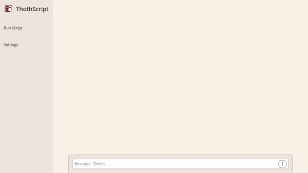

# ThothScript

## Overview

ThothScript is a chatbot application that allows you to interact with the [ThothScript-operator](https://github.com/jordojordo/thothscript-operator), which implements GPTScript on a Kubernetes cluster with `kubectl` and `helm` capabilities. This application enables users to automate tasks using natural language instructions, providing an intuitive way to manage Kubernetes resources.

ThothScript combines the wisdom of the ancient Egyptian deity Thoth, known for knowledge and writing, with the power of GPT, an advanced language model, to facilitate seamless Kubernetes management through conversational interfaces.



## Features

- Chatbot interface to interact with ThothScript-operator
- Supports natural language scripting with GPTScript
- Kubernetes resource management with `kubectl` and `helm`
- Flexible task automation and orchestration

## Installing with Helm

To deploy the ThothScript UI on a Kubernetes cluster using the Helm chart, follow these steps:

1. Add the Helm repository (if applicable):

  ```bash
  helm repo add jordojordo https://jordojordo.github.io/helm-charts
  helm repo update
  ```

2. Install the Helm chart with the release name thothscript-ui:

  ```bash
  helm install thothscript-ui jordojordo/thothscript
  ```

### Configuration

The Helm chart allows for a variety of configurations. Refer to the values.yaml file for a list of configurable parameters and their default values. Key environment variables include:

- THOTHSCRIPT_PROXY_HOST: The host URL for the proxy. This should be set to the service address where the frontend is served from.
- THOTHSCRIPT_PROXY_PORT: The port for the proxy.
- THOTHSCRIPT_OPERATOR_HOST: The host URL for the ThothScript operator within the cluster.
- THOTHSCRIPT_OPERATOR_PORT: The port for the ThothScript operator within the cluster.

For more detailed information on configuration, refer to the [Helm chart documentation](https://github.com/jordojordo/helm-charts/tree/master/charts/thothscript).

## Quickstart Minikube Demo

To quickly set up ThothScript on Minikube, follow these steps using the provided `minikube-example.sh` script:

1. Clone the ThothScript repository:

    ```bash
    git clone https://github.com/jordojordo/thothscript.git
    cd thothscript
    ```

2. Ensure you have Minikube, kubectl, and Helm installed.

3. Run the `minikube-example.sh` script with your OpenAI API key:

    ```bash
    ./scripts/minikube-example.sh -k <OPENAI_API_KEY>
    ```

This script will:

- Start Minikube
- Create a namespace for ThothScript
- Deploy the ThothScript operator using Helm
- Deploy the ThothScript UI using Helm
- Configure the necessary services and ingress
- Provide the URL to access the application

Your application should be accessible at the URL provided at the end of the script execution.

## Development

To get started with ThothScript, clone the repository and install the dependencies:

```bash
git clone https://github.com/jordojordo/thothscript.git
cd thothscript
yarn
```

## Usage
To run the development server:

```bash
yarn dev
```

To build the application for production:

```bash
yarn build
```

## Contributing
Contributions are welcome! Please read the contributing guidelines before submitting pull requests.
